# SONOGENESIS

### Artificial ecology of living sound

**A small world with a very large imagination.** SONOGENESIS is a browser-based artificial-life instrument: organisms inherit genomes that shape their bodies, behavior, metabolism, and voices; habitats decide which signals carry and which lineages thrive. Watch the ecology change, then tune, inspect, breed, and archive its inhabitants.

The result is both a simulation you can explore and a soundscape composed by the system itself.

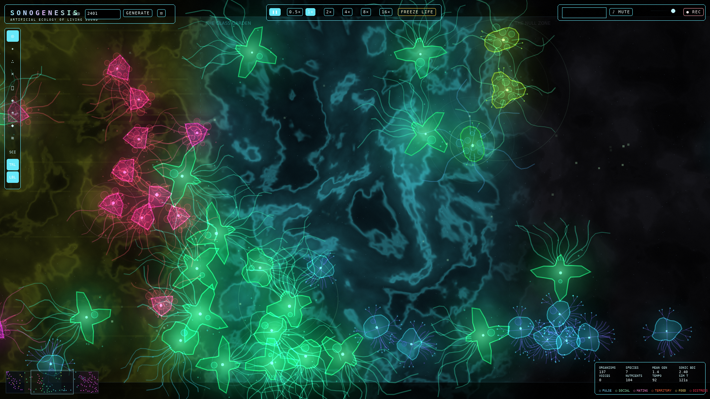

*The full world at t = 121 s (seed 2401). The habitat bands, nutrient particles, call signals, and minimap are all live simulation state, drawn by the app's own Canvas 2D renderer.*

## At a glance

- **43-gene organisms** express into visible morphology, ecological traits, and synthesizer parameters.
- **Five contrasting habitats** create changing resource, thermal, movement, and acoustic conditions.
- **Emergent interactions** include foraging, flocking, predation, mating, social response, synchrony, and speciation.
- **Generative audio** turns six classes of organism calls into spatialized Web Audio synthesis, with tempo, scales, reverb, delay, drones, and WAV capture.
- **An instrument panel for the ecosystem** provides genome editing, selective breeding, habitat controls, evolutionary telemetry, historical playback, and a local specimen archive.
- **Client-side by design**: the simulator needs no application server, account, or API credentials. Saved work stays in the browser until you export it.

> **Model note:** this is an exploratory artificial-life artwork, not a validated ecological or scientific model. See [the simulation notes](docs/SIMULATION.md) for the implemented rules and their limits.

## Explore

### Start locally

**Prerequisites:** Node.js `^20.19.0` or `>=22.12.0` and npm. These are the Node ranges required by the locked Vite toolchain.

```bash
npm ci
npm run dev
```

Open the local URL printed by Vite (normally `http://localhost:5173`). Choose **Enter with sound** to unlock browser audio, or **Silent observation** to explore without audio. Audio playback requires a user gesture in modern browsers.

### Build and verify

```bash
npm run typecheck
npm run build
npm run preview
```

The static production site is written to `dist/`. `npm run preview` serves that build locally; it is not a production server. GitHub Actions runs the dependency audit, typecheck, and production build. There is not yet a unit-test or browser-test runner.

### First few minutes

1. Keep the default seed (`2401`) or enter another number or phrase, then select **Generate**.
2. Scroll to zoom and drag empty space to pan. Click an organism to inspect its phenotype, calls, genome, and lineage.
3. Open the **Control Deck** to alter habitat conditions, evolutionary pressure, and audio settings.
4. Try the **Mutation Laboratory** to cross or mutate genomes, select toward an acoustic target, audition offspring, and release a strain into the world.
5. Use the **Observatory** to inspect population and sound statistics, scrub keyframes, and optionally rewind the world. Save specimens and ecosystem snapshots in the **Archive**.

The [user guide](docs/USER_GUIDE.md) has the complete controls and workflows.

## Controls

| Input | Action |
| --- | --- |
| Scroll | Zoom toward the pointer |
| Drag empty space | Pan the camera |
| Click an organism | Select and inspect |
| Drag an organism | Move it; crossing a habitat boundary records a transplant event |
| Left tool rail | Select, spawn a species, add nutrients, or cull; open panels and display toggles |
| `Space` | Pause or resume world stepping; conductor automation can continue |
| `1`–`6` | Set simulation speed to `0.5×`, `1×`, `2×`, `4×`, `8×`, or `16×` |
| `F` | Toggle freeze-life mode (aging, metabolism, and reproduction pause; interactions continue) |
| `M` | Enable, mute, or unmute audio |
| `H` | Toggle Control Deck |
| `O` | Toggle Observatory |
| `L` | Toggle Mutation Laboratory |
| `C` | Toggle Conductor |
| `G` | Toggle scientific overlays |
| `Escape` | Clear selection and tracking |

Freeze-life mode does **not** make the ecosystem inert: movement, feeding, predation, communication, and audio continue, so predation can still cause deaths. The Archive is opened from the left tool rail.

## How it is built

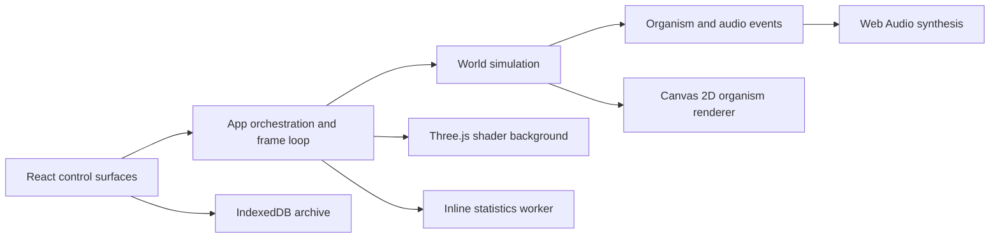

React owns the controls and application lifecycle; the mutable `World` and `AudioEngine` instances are kept outside React render state. A request-animation-frame loop steps the simulation at a fixed `1/30 s` step, drains sound events, updates the camera and renders two canvas layers. A worker calculates diversity summaries away from the main thread. There is no HTTP API or remote simulation service.

| Layer | Implementation |
| --- | --- |
| UI and app shell | React 19, TypeScript, Tailwind CSS 4 |
| Build and local preview | Vite 7 |
| World and genetics | TypeScript, seeded PRNG, spatial grid |
| Organism rendering | Canvas 2D |
| Atmospheric background | Three.js, custom GLSL shader |
| Sound | Web Audio API |
| Diversity summaries | Inline Web Worker |
| Local archive | IndexedDB |

For module boundaries, state ownership, and update order, see [Architecture](docs/ARCHITECTURE.md). For source-level contracts, see the [internal API reference](docs/API.md).

## Inside the aquarium

Every frame below is a real application state: the world layer drawn by the app's Canvas 2D renderer over its Three.js shader background, with the panels driven by the same statistics the simulation records. The hero shot uses the default seed (`2401`); all frames come from the same run.

| | |
| --- | --- |
| 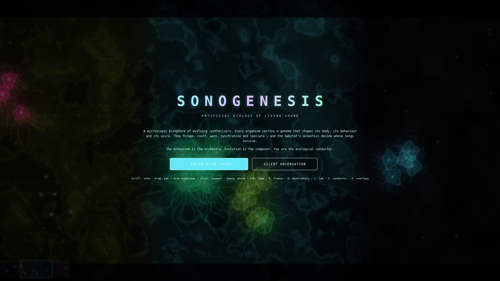 | 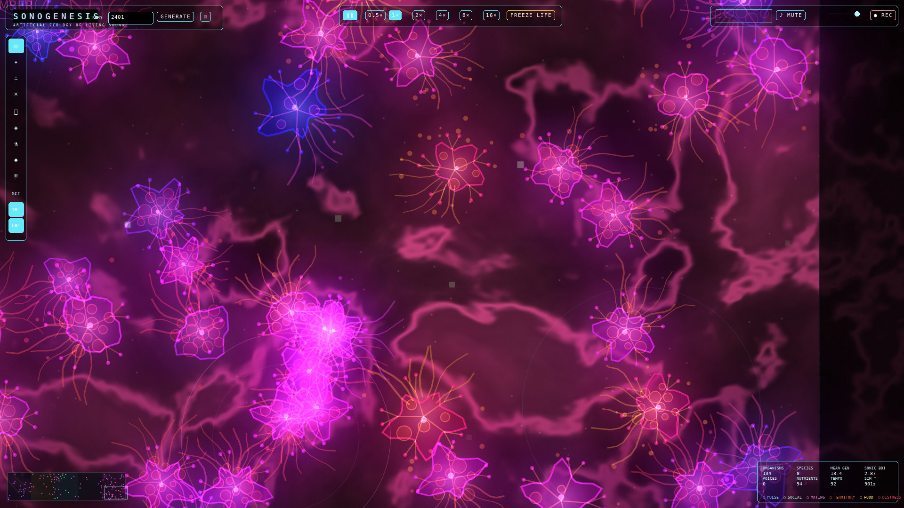 |
| *t = 0 — the start screen with the seed field and the first 40 organisms before the world begins moving.* | *t = 1200 s, zoomed in — bodies are drawn from genome expression: medusoid forms, tentacles, and per-individual color.* |
| 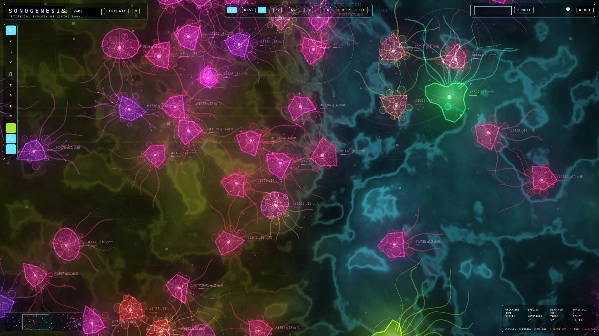 | 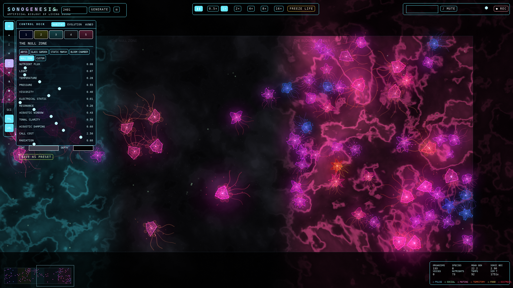 |
| *t = 1400 s with the scientific overlays (`G`) — organism voices, habitat boundaries, and the spatial grid the simulation uses for neighbor lookups.* | *The Control Deck — habitat conditions, evolutionary pressure, and audio settings, editable while the world keeps running.* |
| 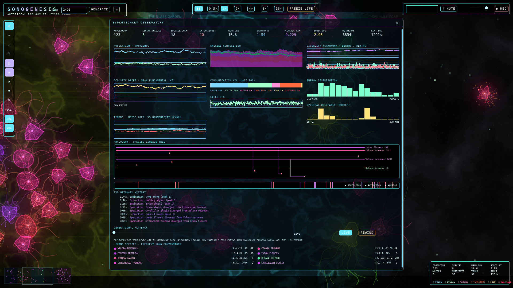 | 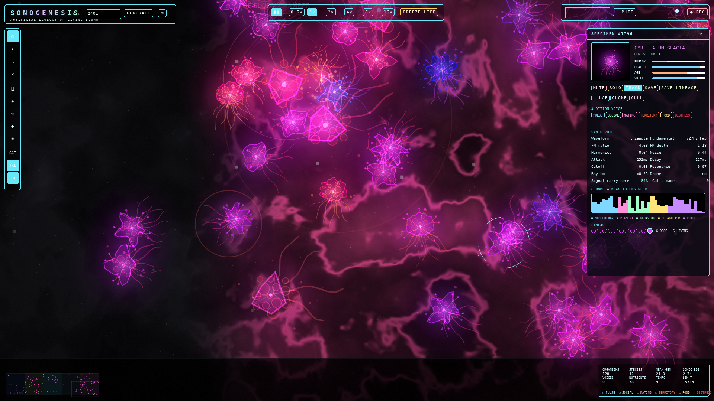 |
| *t = 1550 s — the Observatory: live population and sound statistics, keyframes, and the world rewind control.* | *t = 1750 s — the inspector for the selected organism: phenotype, call profile, genome, and lineage.* |

## The ecology, measured

The figures below are plotted from telemetry recorded during a single deterministic run of the actual `World` simulation — seed `2401`, 1800 s of simulated time, 30 fixed steps per second. It is the same `src/sim/world.ts` the browser runs, executed headlessly; every point is a number the simulation itself recorded, and no curve is illustrative.

| | |
| --- | --- |
| 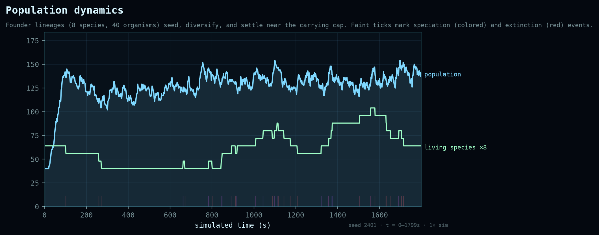 | 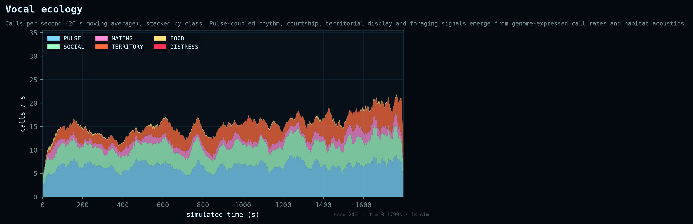 |
| *Population and living species over 30 simulated minutes. The community grows from 40 founders to about 150 organisms and repeatedly diversifies, crashes, and recovers; speciation events are marked along the timeline.* | *Calls per second by class (20 s moving average). Pulse calls dominate the soundscape; mating, food, and social calls rise as the population establishes.* |
| 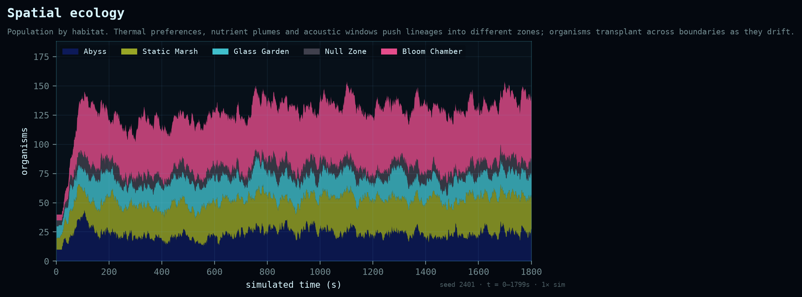 | 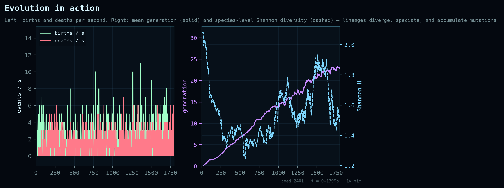 |
| *Population by habitat. Thermal preferences, nutrient plumes, and acoustic windows sort the lineages spatially, and each zone keeps a stable share of the community.* | *Left: births and deaths per second. Right: mean generation (solid) and species-level Shannon diversity (dashed) — lineages diverge, speciate, and accumulate mutations.* |

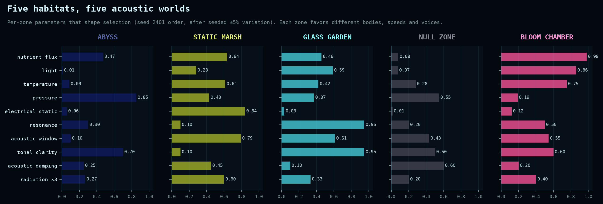

*The five habitats' per-zone parameters (seed 2401 order, after seeded ±5% variation). Each zone favors different bodies, speeds, and voices.*

**How these were made.** [`scripts/sim-telemetry.mjs`](scripts/sim-telemetry.mjs) runs `src/sim/world.ts` headlessly — bundled with the project's own esbuild toolchain, no browser required — and writes every per-second statistic the simulation records. [`scripts/make_charts.py`](scripts/make_charts.py) plots them. Regenerate the set with:

```bash
npm ci
pip install matplotlib numpy
python3 scripts/make_charts.py
```

## Repository map

```text
.
├── src/
│   ├── audio/       Web Audio synthesis and WAV encoding
│   ├── components/  React panels and shared controls
│   ├── render/      WebGL background and Canvas 2D foreground
│   ├── sim/         Genomes, habitats, world, morphology, RNG, stats worker
│   ├── App.tsx      App state, input routing, frame loop, persistence workflows
│   ├── conductor.ts Automation lanes for ecological and audio parameters
│   └── db.ts        IndexedDB stores and persistence record types
├── docs/            Architecture, design, operations, and maintenance notes
│   └── images/      Screenshot and telemetry figures used in this README
├── scripts/         Headless telemetry run and chart generator for the README figures
├── public/
│   └── _redirects   Static-host fallback for the application entry point
└── .github/
    └── workflows/  Typecheck and production-build verification
```

## Documentation

| Guide | What it covers |
| --- | --- |
| [Architecture](docs/ARCHITECTURE.md) | Runtime boundaries, component roles, data flow, extension points |
| [Simulation model](docs/SIMULATION.md) | Genome, habitats, ecology, communication, reproduction, determinism |
| [Internal API](docs/API.md) | World, genetics, rendering, audio, automation, and storage contracts |
| [User guide](docs/USER_GUIDE.md) | Controls and end-to-end creative workflows |
| [Data and privacy](docs/DATA_AND_PRIVACY.md) | IndexedDB records, import/export, privacy, and migrations |
| [Testing and quality](docs/TESTING.md) | Existing checks, manual verification, and test gaps |
| [Performance](docs/PERFORMANCE.md) | Runtime budgets, caps, bottlenecks, and profiling priorities |
| [Accessibility](docs/ACCESSIBILITY.md) | Current support, known barriers, and planned work |
| [Deployment](docs/DEPLOYMENT.md) | Cloudflare Pages and other static hosting |
| [Roadmap](docs/ROADMAP.md) | Proposed, explicitly uncommitted work |
| [Contributing](CONTRIBUTING.md) | Setup, change expectations, review, and licensing status |
| [Changelog](CHANGELOG.md) | Forward-looking change record |
| [Security](SECURITY.md) | Reporting guidance and data-import cautions |

## Engineering and design rationale

- **Ecology before composition:** genomes shape sound, while resource and acoustic conditions shape survival and communication. The audio layer renders calls; it does not decide the underlying ecological response.
- **Inspectable state:** genes, phenotypes, lineage, statistics, and automation lanes are exposed as controls rather than hidden behind a black box.
- **Browser-native runtime:** static assets and standard browser APIs keep setup small and make local archives private to the current browser origin.
- **Bounded hot paths:** neighbor queries use a coarse spatial grid; analysis runs in a worker; frame rendering is separated from React's lower-frequency UI refresh.
- **Honest reproducibility:** a numeric or text seed creates a repeatable starting world, but it is not a promise of bit-for-bit replay after arbitrary interaction or export/import. See [determinism notes](docs/SIMULATION.md#randomness-and-reproducibility).

## Quality, performance, and accessibility

`npm run typecheck` uses strict TypeScript checks; `npm run build` verifies the production bundle. These checks do not replace behavioral tests. The repo currently has no unit, integration, or browser-automation suite, and no WCAG conformance claim. Performance and accessibility limits are documented candidly, with concrete follow-up work in the [roadmap](docs/ROADMAP.md).

For large populations, begin at `1×` and increase speed gradually. Audio capture is buffered in memory until the WAV is exported; long recordings need available RAM. See [Performance](docs/PERFORMANCE.md) and [Accessibility](docs/ACCESSIBILITY.md).

## Data and license

The app has no application backend or explicit telemetry path. Specimens, presets, and snapshots are stored in this browser's IndexedDB database; they are not synced or backed up unless exported. See [Data and privacy](docs/DATA_AND_PRIVACY.md).

**Licensing status:** the repository's current [`LICENSE`](LICENSE) is an all-rights-reserved notice and grants no general redistribution or modification rights. That is **not** an open-source license. Do not assume the project is open source or submit code under an unstated license; the rights holder must choose and publish licensing and contribution terms before broader community reuse. See [Contributing](CONTRIBUTING.md).

---

*The ecosystem is the orchestra. Evolution is the composer. You are the ecological conductor.*
