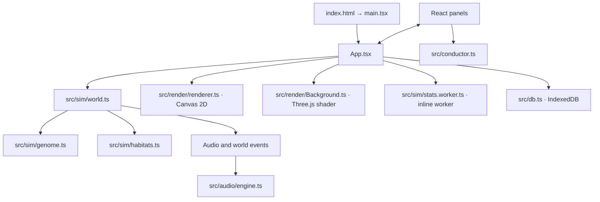

# Architecture

[← Back to the README](../README.md)

This document describes the implementation as it exists in `src/`. It is an architectural map, not a claim that the simulation is a validated scientific model or that internal TypeScript exports are a stable library API.

## System boundary

SONOGENESIS is a static, browser-only application. It has no server process, remote simulation service, or HTTP API. `index.html` loads `src/main.tsx`; `main.tsx` mounts the React application; `App.tsx` coordinates user input, long-lived runtime objects, persistence, rendering, and the animation loop.

All of these systems execute in the user's browser. The simulation, drawing, Web Audio graph, worker, and IndexedDB archive are local to the page and its origin.

## Runtime and data flow

1. **Boot:** `App` creates a seeded `World` (default seed `2401`), an `AudioEngine`, camera state, and default conductor lanes. The audio context is not started until a user gesture requests it.
2. **Frame loop:** a `requestAnimationFrame` callback owns the hot loop. It clamps wall-clock delta to `0.1 s`, scales an accumulator by the selected speed, and advances the model in `SIM_DT = 1 / 30 s` steps. It runs at most 40 simulation steps per browser frame; if that ceiling is reached, remaining accumulated time is discarded rather than causing an unbounded catch-up.
3. **Ecology:** `World.step(dt)` updates food, neighborhood grids, organism movement and interactions, metabolism, calls, reproduction, cleanup, summaries, and keyframes. The simulation itself receives a time step; the UI is responsible for supplying the fixed step.
4. **Sound:** each step may append to `World.audioEvents`. The frame loop drains the queue, then asks `AudioEngine` to synthesize eligible events when audio is active and the app is not displaying historical playback. World-level signals affect organism behavior; viewport distance and stereo position affect what the listener hears.
5. **Drawing:** `Background` renders the habitat atmosphere with Three.js and a fragment shader. `renderWorld` draws food, signal rings, trails, organisms, overlays, reticles, and the minimap on a separate Canvas 2D surface.
6. **Analysis:** once the world has at least two organisms, `App` posts genomes and acoustic traits to an inline Web Worker about every three wall-clock seconds. The worker returns gene spread, sampled genetic distance, and binned acoustic-diversity summaries. The world also records ecological samples every simulated second and population keyframes every 12 simulated seconds.
7. **React refresh:** the canvas loop does not depend on a React render every frame. `App` requests UI refreshes at roughly four times per second; state that changes less often (selected specimen, active panel, pause/speed) is stored in React state.
8. **Persistence:** user actions write specimens, ecosystem snapshots, and habitat presets to IndexedDB. Persistence is independent of the animation loop and is scoped to the browser origin.

## State ownership

| State or service | Owner | Notes |
| --- | --- | --- |
| Simulation world | `worldRef` in `App` | Mutable domain object. Panels receive the live instance and can update parameters through callbacks or direct field mutation. |
| Audio graph | `audioRef` in `App` | Created lazily after a user gesture; controls call methods on one long-lived engine. |
| Camera and animation state | refs in `App` | Keeps high-frequency coordinates, pointer gestures, and frame-loop state out of React renders. |
| UI state | React state in `App` and panels | Panel visibility, selection, speed, pause, playback, and other presentation state. |
| Historical analysis | `World.stats`, keyframes, worker result | World summaries are sampled in the domain; genetic/acoustic analysis is calculated by the worker. |
| Local archive | `src/db.ts` | IndexedDB database `sonogenesis`, version 1, with `specimens`, `snapshots`, and `presets` stores. |

This design deliberately favors a responsive canvas and simple single-threaded mutation over immutable world snapshots on every frame. The trade-off is that application wiring and mutable-state discipline live largely in `App.tsx`; a future extraction should preserve the current step order and event ownership.

## Component inventory

| Component | Responsibility and integration |
| --- | --- |
| `App` | Application shell, frame scheduler, camera/input routing, audio lifecycle, tool rail, save/load workflows, and panel orchestration. |
| `ControlDeck` | Habitat presets and sliders, global evolutionary controls, scale/tempo/effects, and locally saved habitat presets. Receives `World`, `AudioEngine`, selected zone, and callbacks. |
| `Inspector` | Selected organism telemetry, call audition, mute/solo/track, genome editing, clone/cull, specimen/lineage save, and lineage navigation. |
| `GenomeEditor` / `SpecimenThumb` | Interactive gene bars and Canvas 2D organism previews. The editor's optional `onChange` controls whether it is editable. |
| `Lab` | Genome workbench, mutation/crossover, heuristic acoustic selection, auditions, and releasing or saving strains. |
| `Observatory` | Population and diversity charts, species summaries, phylogeny, event history, and keyframe scrub/rewind. |
| `Library` | Specimen and snapshot browsing, JSON import/export, release/revival, load, and delete. |
| `Conductor` | Timeline editor for ecological/audio automation lanes, including breakpoint editing and loop/seek controls. |
| `components/ui.tsx` | Shared panel, button, slider, statistic, chart, and bar primitives. |

Panels are not independent packages. Their prop interfaces are defined in their source files; `App` supplies callbacks that connect controls to the world, audio engine, or archive.

## Important implementation boundaries

### Simulation and presentation

- `src/sim/` is the domain layer: seeded random number generation, genotype/phenotype mapping, habitats, body-independent organisms, and aggregate statistics.
- `src/render/` is presentation: the foreground renderer uses Canvas 2D and the background uses a Three.js shader. Body geometry is generated lazily and cached on an organism; it is not the simulation's collision representation.
- `src/audio/engine.ts` converts `AudioEvent`s into oscillators, filters, envelopes, noise, spatial panning, effect sends, and optional drones. It is a real-time instrument, not a physically accurate acoustic solver.
- `src/sim/stats.worker.ts` is analysis-only. It receives copies of arrays from the main thread and does not own or mutate `World`.

### Time and event semantics

Simulation time is independent of wall-clock time. Pause prevents `World.step`; speed changes the rate at which fixed simulation steps are consumed. Conductor automation advances from the frame-loop's wall-clock delta. Historical playback renders hydrated keyframe organisms while the live world object remains available. Rewind restores a population keyframe into the current world; it is not a full event-sourced replay.

### Persistence and compatibility

`World.serialize()` emits version `v: 1`; `World.deserialize()` reconstructs derived phenotypes and runtime-only organism fields. The IndexedDB schema is also version 1. Imported JSON currently receives only a shallow shape check, not comprehensive schema validation. See [Data and privacy](DATA_AND_PRIVACY.md) before changing these formats.

## Extension rules

Keep cross-module behavior explicit when extending the domain:

- **Add a gene:** update `GENES` and `express` in `src/sim/genome.ts`, then review mutation/crossover behavior, editor labels, statistics, and all consumers of genome positions. Avoid introducing new magic numeric indexes; one existing archive thumbnail currently reads the hue gene at index `10`.
- **Add a call type:** update `CallType`, `CALL_TYPES`, and `CALL_COLORS` in `src/sim/world.ts`, then cover emission/response behavior and synthesis in `AudioEngine.playCall`.
- **Add a habitat parameter:** update `HabitatParams`, each preset, the control surface, and any simulation/audio mapping that should respond to it. Update the simulation and user docs together.
- **Add an automation lane:** keep its key/type, default curve, interpolation, and `applyLanes` mapping in `src/conductor.ts` aligned with controls and snapshot persistence.
- **Change a stored record:** version and migrate the IndexedDB schema and serialized-world format; do not rely on TypeScript casts as input validation.
- **Change a hot loop:** preserve the fixed-step/event-drain/render order, add a bounded workload, and profile at realistic population sizes before increasing caps.

## Engineering rationale and known trade-offs

| Choice | Benefit | Cost or boundary |
| --- | --- | --- |
| Mutable simulation object behind a ref | Avoids reconstructing a large world through React on each frame. | Mutation can make component dependencies implicit; state-changing callbacks need deliberate UI refreshes. |
| Fixed-step accumulator | Keeps each model update at a consistent `1/30 s` step across normal frame-rate variation. | A 40-step per-frame ceiling drops backlog at extreme speeds or after stalls. |
| Coarse spatial grid (`140` world units per cell) | Narrows repeated organism/food neighborhood scans. | Queries still inspect candidate objects in intersecting cells; this is not a collision tree or a hard population guarantee. |
| Canvas 2D plus shader background | Keeps organism drawing direct and the atmospheric layer GPU-friendly. | Canvas entities do not have an accessible DOM representation; WebGL capability is required for the background. |
| Worker for summary analysis | Moves sampled diversity calculations off the animation thread. | It is not a worker-based simulation; pairwise genetic distance is sampled and uses `Math.random`. |
| IndexedDB | Saves work without an account or server. | Browser storage can be cleared, evicted, or quota-limited; there is no sync or migration framework yet. |

For current workload limits, see [Performance](PERFORMANCE.md). For known interaction barriers, see [Accessibility](ACCESSIBILITY.md).
